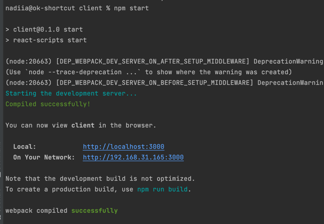
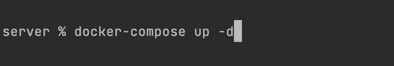
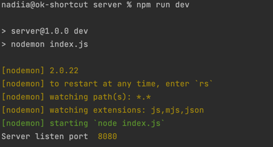

# Test FullStack dev 

# Start client part 

## You must be in TestBESKYD directory

### `cd client`
### `npm install`
### `npm start` 

# Start server part

## !Open new terminal!

## You must be in TestBESKYD directory

### `cd server`
### `npm install`

## Connect to DB with docker-compose

### `docker-compose up -d`

### `npm run dev`

